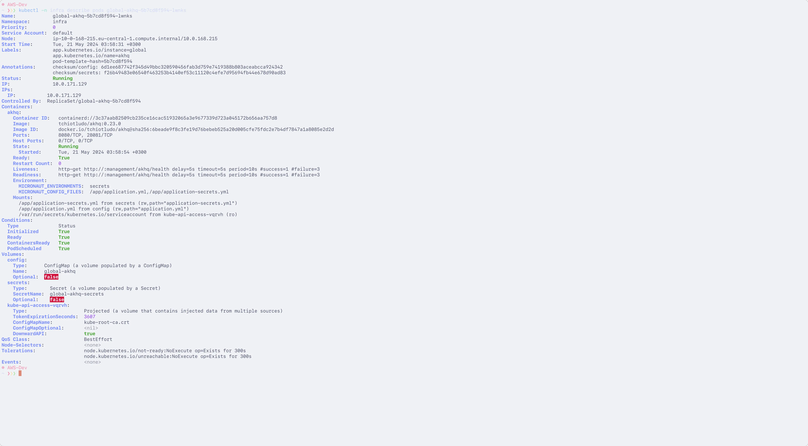

<h3 align="center">
	<br/>
	
	Catppuccin for <a href="https://github.com/kubecolor/kubecolor">kubecolor</a>
	
</h3>

<p align="center">
	<a href="https://github.com/vkhitrin/kubecolor-catppuccin/stargazers"></a>
	<a href="https://github.com/vkhitrin/kubecolor-catppuccin/issues"></a>
	<a href="https://github.com/vkhitrin/kubecolor-catppuccin/contributors"></a>
</p>

<p align="center">
	
</p>

## Previews

<details>
<summary>🌻 Latte</summary>

</details>
<details>
<summary>🪴 Frappé</summary>

</details>
<details>
<summary>🌺 Macchiato</summary>

</details>
<details>
<summary>🌿 Mocha</summary>

</details>

## Adding The Themes

1. Download theme file(s):

```bash
wget -P "/tmp/" https://github.com/vkhitrin/kubecolor-catppuccin/raw/main/catppuccin-latte.yaml
wget -P "/tmp/" https://github.com/vkhitrin/kubecolor-catppuccin/raw/main/catppuccin-frappe.yaml
wget -P "/tmp/" https://github.com/vkhitrin/kubecolor-catppuccin/raw/main/catppuccin-macchiato.yaml
wget -P "/tmp/" https://github.com/vkhitrin/kubecolor-catppuccin/raw/main/catppuccin-mocha.yaml
```

2. Copy theme to `${HOME}/.kube/color.yaml` **OR** set `KUBECOLOR_CONFIG=<PATH_TO_THEME>`

```bash
cp /tmp/catppuccin-mocha.yaml ${HOME}/.kube/color.yaml # Option 1
export KUBECOLOR_CONFIG="/tmp/catppuccin-mocha.yaml" # Option 2

```
